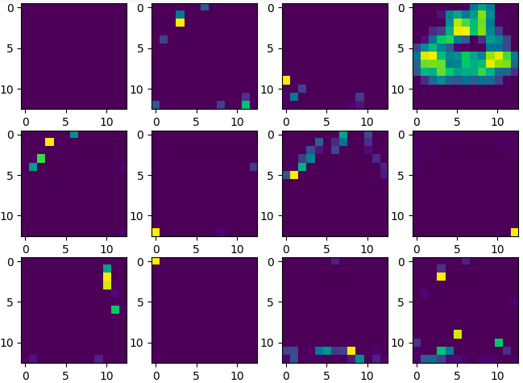
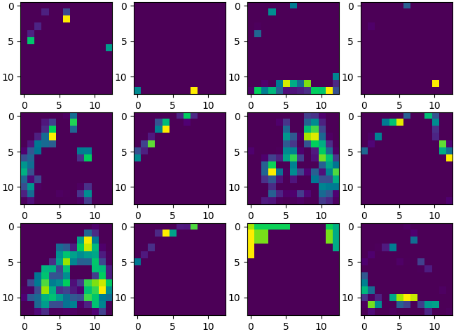
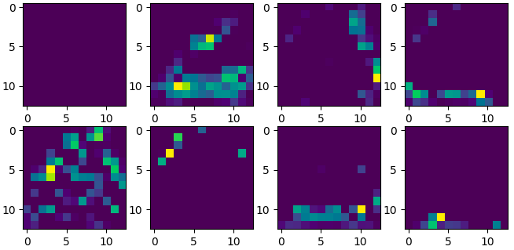
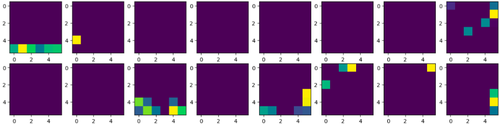
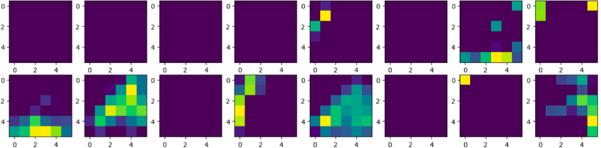

## Context


**Deep Draw** is a project from Le Wagon, batch Data Science n°1002 (sept-dec 2022). Initiated by Sébastien Hubert, the objective is to apply Deep Learning science and use a **CNN model** with the available [QuickDraw dataset](https://console.cloud.google.com/storage/browser/quickdraw_dataset/) from google. This allow guesses the sketche of an user among 100 categories of randomly chosen draws. To go further, a **RNN model** will also be tested.
Sébastien was joined by Valentin Paris, Alexia Fraidenraich and Jean-Baptiste Guérin to work on the Deep-Draw project during theses 2 weeks working, supervized by Laure De Grave.

<br>

## Acknowledgments

👉 Thanks to our supervizor **Laure De Grave** and our Lead Teacher **Vincent Moreau** for their help and investment on this project.

👉 Thanks to Google Creative Lab for the quickdraw-dataset from [googlecreativelab repository](https://github.com/googlecreativelab/quickdraw-dataset)

[](https://github.com/googlecreativelab/quickdraw-dataset)

👉 Thanks to Tensorflow for their repository about [Recurrent Neural Networks for Drawing Classification](https://github.com/tensorflow/docs/blob/master/site/en/r1/tutorials/sequences/recurrent_quickdraw.md)

[](https://github.com/tensorflow)


<br>

## Objectives

1. Initialize our [Repository Github for deepdraw](https://github.com/Sythak/deepdraw)
2. Downloading, loading and prepare the Quick Draw dataset for CNN Model
3. Initialize and Run the CNN model
4. Create an API and fast API with streamlit 👉 it Will be our user interface
5. Store the work with Mlflow
6. Create a Docker container and push it in production with GCP
7. Going further 👉 do the same with a sequential data and an RNN model


<br>

# 1️⃣ Project Setup 🛠

## Deep-Draw directory

We create our working environment diagrammed by this tree directory

```bash
.
├── Dockerfile                      # Contain our docker
├── Makefile                        # Task manager
├── README.md
├── accueil_deep_draw.png
├── build
│   └── lib
│       └── deep_draw
│           └── fast_api.py
├── deep_draw                       # Main project directory
│   ├── __init__.py
│   ├── dl_logic                    # Deep-Learning classification directory
│   │   ├── __init__.py
│   │   ├── categories.yaml         # Listing of our choosen categories
│   │   ├── cnn.py                  # CNN model
│   │   ├── data.py                 # Loading , cleaning, encoding data
│   │   ├── params.py               # Manage main variables
│   │   ├── preprocessor.py         # Preprocessing data
│   │   ├── registry.py             # Manage model
│   │   ├── rnn.py                  # RNN model
│   │   ├── test_categories.yaml
│   │   ├── tfrecords.py            # Encoding data bitmap --> tfrecords obj
│   │   └── utils.py
│   ├── fast_api.py                 # Initialize API
│   └── interface
│       ├── Deep_Draw.py
│       ├── __init__.py
│       ├── accueil_deep_draw.png
│       ├── app.py
│       ├── main.py
│       ├── pages
│       │   ├── Probabilities_📊.py
│       │   └── Submit_🎉.py
│       └── utils.py
├── deep_draw.egg-info
├── notebooks                       # Stockage notebooks
├── packages.txt
├── raw_data                        # Stockage data
│   ├── dataset.py
│   ├── ndjson_simplified
│   └── npy
├── requirements.txt                # all the dependencies we need to run the package
├── requirements_prod.txt
└── setup.py                        # package installer
```
<br>

# 2️⃣  CNN - Prepare the data 📡

## 💻 Encoding dataset from bitmap to tfrecords

For our CNN model, we use the data in **.npy type** from QuickDraw dataset. This allow us to use bitmap format for our images. One categorie (cats for exemple) contain **100 000 differents draws** .

The real challenge is to load and run the model for at least **100 categories**, corresponding to **10 000 000 draws** !!! 🙊

Thats' why we need to convert the data in an object tensorflow. With it, we can split the data into many packs of 32 draws and make the model easily and faster. Then, we can avoid the expected problemes from RAM memory.

<br>

# 3️⃣ Make and run the CNN model

## DeepLearning CNN Model - Our code

We have chosen a conventionnal CNN model

```python
#Initialize a CNN Model

model = Sequential()

    model.add(Conv2D(16, (3,3), activation='relu', input_shape=(28,28,1)))
    model.add(MaxPooling2D((2,2)))

    model.add(Conv2D(32, (3,3), activation='relu', padding='same'))
    model.add(MaxPooling2D((2,2)))

    model.add(Conv2D(64, (3,3), activation='relu', padding='same'))
    model.add(MaxPooling2D((2,2)))

    model.add(Flatten())
    model.add(Dense(128, activation='relu'))
    #model.add(Dropout(0.4))
    model.add(Dense(num_classes, activation = 'softmax'))

#Compile

model.compile(
        optimizer='adam',
        loss='sparse_categorical_crossentropy',
        metrics=['accuracy'])

    print("\n✅ model compiled")
    return model

#Training

es = EarlyStopping(monitor="val_loss",
                  patience=patience,
                  restore_best_weights=True,
                  verbose=0)

history = model.fit(dataset_train,
                    validation_data = dataset_val,
                    epochs = 100,
                    batch_size = 32,
                    callbacks = [es],
                    verbose = 1)
```
<br>

The accuracy obtained is around 80% which is sufficient for what we want to do with it.

Here is a 3D visualize of our model

<br>


<br>

## Modelisation results


<br>


<br>

## Show Convolution effect

<br>

Here, we will show you the convolution effect of our CNN model using conv2D layers.
Let's take a sample of data : the first draws for theses 3 categories 🐱 🐷 🐸
<br>


<br>


We still reconize them right ? Just focus on the cat 🐱 and let's start with applying the **first convolution Layer** contain 16 kernels !

<br>


<br>

Here, we can observe that the last kernels takes more data than the first.

💡 Spoiler Alert : it's the same pattern for all draws.
To going further, let's see what happened if we add a **second convolution Layer** contain 32 kernels !

<br>





<br>

With this convolution, the model take more parts from the first draw. We can reconize the nose or the ears of the cat but the majority of the pictures start to be not understandable.

For fun, here is an extract from the output of the **third convolution Layer** contain 64 kernels !

<br>




<br>

Beautiful abstract art, isn't it ? 👩‍🎨

<br/>

# 3️⃣ Making an API to manage the user interface with streamlite

# 4️⃣ Machine Learning Operations : Dockers

# 5️⃣ Going Further : The RNN model
