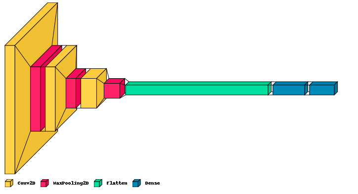
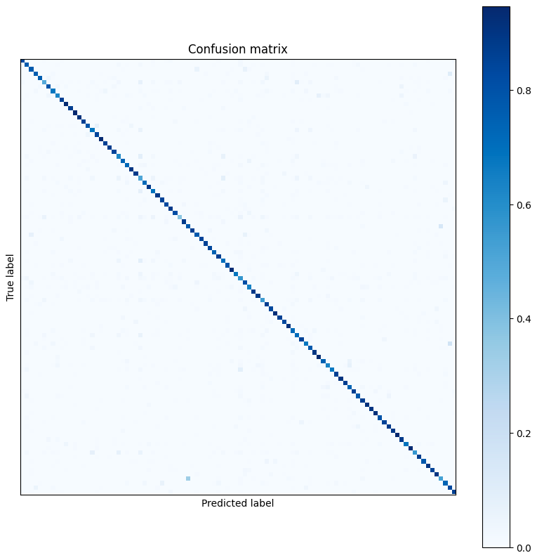
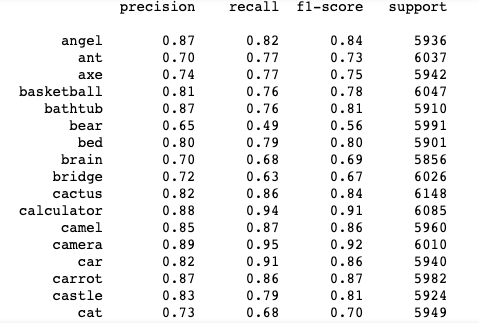
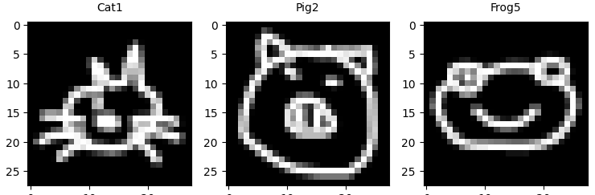
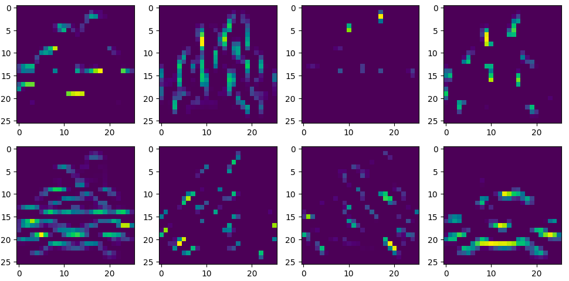
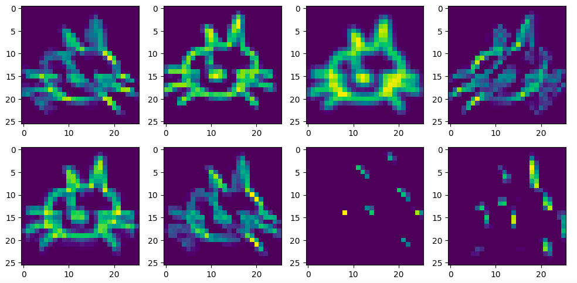
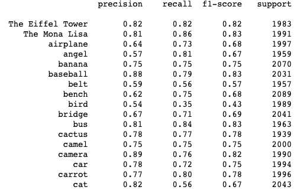

## Context

<br>

**Deep Draw** is a project from [Le wagon data science school](https://www.lewagon.com/data-science-course) in Paris, batch #1002 (Sept.-Dec. 2022). The objective is to develop, train and apply **neural networks models** on the [QuickDraw dataset](https://console.cloud.google.com/storage/browser/quickdraw_dataset/) published by [Google Creative Lab](https://github.com/googlecreativelab/quickdraw-dataset). 100 categories of sketches have been selected and were used to train a CNN-based model and a RNN-based model in order to categorize drawings.

<br>

## Acknowledgments

👉 Thanks to our supervizor [Laure de Grave](https://github.com/casicoco) and our Lead Teacher [Vincent Moreau](https://github.com/vtmoreau) for their help and investment on this project.

👉 Thanks to Google Creative Lab for the quickdraw-dataset from [googlecreativelab repository](https://github.com/googlecreativelab/quickdraw-dataset)

[](https://github.com/googlecreativelab/quickdraw-dataset)

<br>

## Summary

1. Initialize our [Repository Github for deepdraw](https://github.com/Sythak/deepdraw)
2. Downloading, loading and prepare the Quick Draw dataset for CNN Model
3. Initialize and Run the CNN model
4. Create an API and fast API with streamlit 👉 it Will be our user interface
5. Store the work with Mlflow
6. Create a Docker container and push it in production with GCP
7. Going further 👉 do the same with a sequential data and an RNN model


<br>

# 1️⃣ Project Setup 🛠

## deepdraw directory

We create our working environment diagrammed by this tree directory

```bash
.
├── Dockerfile                      # Contain our docker
├── Makefile                        # Task manager
├── README.md
├── accueil_deep_draw.png
├── build
│   └── lib
│       └── deep_draw
│           └── fast_api.py
├── deep_draw                       # Main project directory
│   ├── __init__.py
│   ├── dl_logic                    # Deep-Learning classification directory
│   │   ├── __init__.py
│   │   ├── categories.yaml         # Listing of our choosen categories
│   │   ├── cnn.py                  # CNN model
│   │   ├── data.py                 # Loading , cleaning, encoding data
│   │   ├── params.py               # Manage main variables
│   │   ├── preprocessor.py         # Preprocessing data
│   │   ├── registry.py             # Manage model
│   │   ├── rnn.py                  # RNN model
│   │   ├── test_categories.yaml
│   │   ├── tfrecords.py            # Encoding data bitmap --> tfrecords obj
│   │   └── utils.py
│   ├── fast_api.py                 # Initialize API
│   └── interface
│       ├── Deep_Draw.py
│       ├── __init__.py
│       ├── accueil_deep_draw.png
│       ├── app.py
│       ├── main.py
│       ├── pages
│       │   ├── Probabilities_📊.py
│       │   └── Submit_🎉.py
│       └── utils.py
├── deep_draw.egg-info
├── notebooks                       # Stockage notebooks
├── packages.txt
├── raw_data                        # Stockage data
│   ├── dataset.py
│   ├── ndjson_simplified
│   └── npy
├── requirements.txt                # all the dependencies we need to run the package
├── requirements_prod.txt
└── setup.py                        # package installer
```
<br>

# 2️⃣  Preprocess the data 📡

<br>

## Convolutional Neural Network model

<br>

### 💻 Encoding from bitmap format to tfrecords

<br>

For our CNN model, we use the data in **.npy type** from QuickDraw dataset. This allow us to use bitmap format for our images. One categorie (cats for exemple) contain **100 000 differents draws** .

The real challenge is to load and run the model for at least **100 categories**, corresponding to **10 000 000 draws** !!! 🙊

Thats' why we need to convert the data in an object tensorflow. With it, we can split the data into many packs of 32 draws and make the model easily and faster. Then, we can avoid the expected problemes from RAM memory.

<br>

### 💻 Decoding from tfrecords to bitmap format

<br>

## Recurrent Neural Network model

<br>

### 💻 Encoding from ndjson format to tfrecords

<br>

### 💻 Decoding from tfrecords to ndjson format

<br>

# 3️⃣ Make and run the models

## CNN Model - initialize, compile and train

<br>

A conventionnal CNN model is initialized using the `initialize_cnn` method.
Three **Conv2D** layers followed by three **MaxPooling2D** layers are used before the **Flatten** and **Dense** layers.
The output layers uses the softmax activation function to predict 100 probabilities.

The model is compiled using `compile_cnn`. An **Adam** optimizer, a **sparse categorical crossentropy** loss function and the **accuracy** metrics his monitored.

```python
#Initialize a CNN Model

model = Sequential()

    model.add(Conv2D(16, (3,3), activation='relu', input_shape=(28,28,1)))
    model.add(MaxPooling2D((2,2)))

    model.add(Conv2D(32, (3,3), activation='relu', padding='same'))
    model.add(MaxPooling2D((2,2)))

    model.add(Conv2D(64, (3,3), activation='relu', padding='same'))
    model.add(MaxPooling2D((2,2)))

    model.add(Flatten())
    model.add(Dense(128, activation='relu'))
    #model.add(Dropout(0.4))
    model.add(Dense(num_classes, activation = 'softmax'))

#Compile

model.compile(
        optimizer='adam',
        loss='sparse_categorical_crossentropy',
        metrics=['accuracy'])
```
<br>

The final accuracy is around 80% which is sufficient for categorizing sketches.

Here is a 3D visualization of the CNN model

<br>



<br>

### CNN Modelisation results

<br>

Here is the final confusion matrix and the final classification report.

<br>



<br>



<br>

## Activation map

<br>

the activation map shows how neurones specialize whithin the first Conv2D layer.
3 examples from 3 categories 🐱 🐷 🐸 are represented bellow.
<br>



<br>




<br>

## RNN Model - initialize, compile and train

<br>

The RNN model is initialized using the `initialize_rnn_tfrecords` method.

One **Masking** layer followed by two **LSTM** layers are used before the **Dense** layer.
The output layers uses the softmax activation function to predict 100 probabilities.

The RNN model is compiled as the same way than Like the CNN model.

<br>

```python
#Initialize a RNN Model

model = Sequential()

    model.add(layers.Masking(mask_value=1000, input_shape=(1920,3)))
    model.add(layers.LSTM(units = 20, activation= 'tanh', return_sequences= True))
    model.add(layers.LSTM(units = 20, activation= 'tanh', return_sequences= False))

    model.add(Dense(50, activation='relu'))
    model.add(Dense(num_classes, activation = 'softmax'))
```

<br>

The final accuracy for the RNN model is around 75% which is sufficient for categorizing sketches.

<br>

### RNN Modelisation results

<br>

Here is the final confusion matrix and the final classification report.

<br>


<br>



# 3️⃣ The streamlite interface

# 4️⃣ Build an API using Dockers and Fast API
